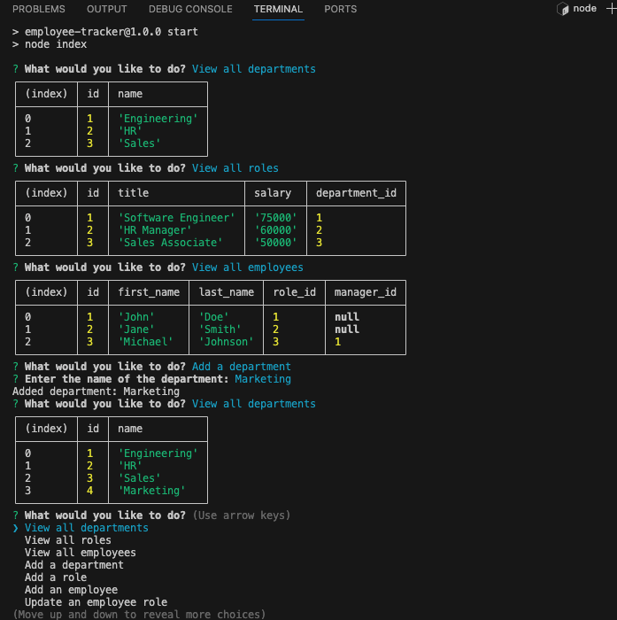

# employee-tracker
## User Story
As a human resources manager,
I want a command-line application to efficiently manage my company's employee database,
So that I can easily view, add, and update information about departments, roles, and employees.

## Acceptance Criteria
GIVEN a command-line application that accepts user input

WHEN I start the application
THEN I am presented with the following options:
View all departments
View all roles
View all employees
Add a department
Add a role
Add an employee
Update an employee role
WHEN I choose to view all departments

THEN I am presented with a formatted table showing department names and department IDs.
WHEN I choose to view all roles

THEN I am presented with the job title, role ID, the department that role belongs to, and the salary for that role.
WHEN I choose to view all employees

THEN I am presented with a formatted table showing employee data, including employee IDs, first names, last names, job titles, departments, salaries, and managers that the employees report to.
WHEN I choose to add a department

THEN I am prompted to enter the name of the department, and that department is added to the database.
WHEN I choose to add a role

THEN I am prompted to enter the name, salary, and department for the role, and that role is added to the database.
WHEN I choose to add an employee

THEN I am prompted to enter the employee’s first name, last name, role, and manager, and that employee is added to the database.
WHEN I choose to update an employee role

THEN I am prompted to select an employee to update and their new role, and this information is updated in the database.

## Mock up

## Walk-through-Video
https://drive.google.com/file/d/1gcLeEAk5eyhZqArZTXruLOmazB0cc8rU/view